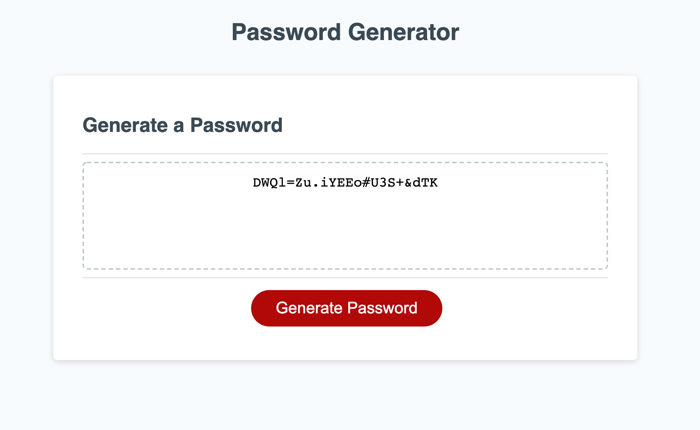

# Password Randomizer

## Description 

Generates a random password of a user-defined lenth (ranging from 8 to 128 characters), and at least one of 4 character types (uppercase, lowercase, numbers, and special characters).

User input is validated using while loops and if statements to ensure a number given is within a set range, and at least one of a set of boolean variables is set to true. The password itself is then generated with a for loop, which runs an amount of times equal to the password length chosed by the user. It pulls each character from an array which is generated based on the choices made by the user when the program gave the character prompts. The program then displays the generated password by changing some text on the HTML page. 

## Usage 

URL: [https://ghall89.github.io/module-3-challenge/](https://ghall89.github.io/module-3-challenge/)

* Click the button
* Enter a number from 8 to 128 in the dialog
* Follow the prompts to choose the character types you want
* Behold your randomized password!

